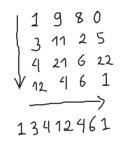
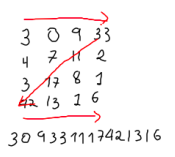

# Vehicle Dealership

## Description 🚀

A multinational automotive company wants to open a car dealership in Cali. This company has a name, a NIT that identifies it, a total of earnings and a number of sales. It also has different types of vehicles, both new and used. You can find a wide range of gasoline-powered cars or motorcycles and a considerable number of electric or hybrid cars.

The dealership has 10 salespeople who can be in charge of up to 5 clients (to make the experience much more personal). As information of the sales consultants there is the name, surname, ID and the amount of total sales for that employee. Of the clients their name, surname, ID, telephone number and email are saved as data. Each customer can be interested in different vehicles while at the dealership.

Regarding the vehicles, each one of them has the following characteristics: a total sale price, a base price, a make, model, cylinder capacity, mileage, and a type that indicates whether the vehicle is new or used and a plate (in case of being new, the plate will be unassigned). Likewise, each one has a list of associated documents (SOAT and mechanical technical review). The vehicle can have one owner (when sold).

Vehicle documents have a price, a year, and an “image” (represented by a matrix) that can be decoded to obtain the document code (decoding varies between document types). Additionally, the mechanical technical review certificate indicates the levels of gases released by the car and the SOAT informs about the amount of coverage regarding third-party accidents.

To decode the code of the documents, a String formed by the integers is returned following a specific path over the matrix:

1. SOAT: Travel in letter L:

2. Mechanical technical review: Travel in letter Z:

Cars will have additional characteristics such as their type (sedan or truck), number of doors, and whether or not their windows are tinted. Additionally, there are 3 types of cars: gasoline, electric or hybrid. Gasoline cars have a tank capacity (in gallons), a type of gasoline (extra, regular, or diesel), and a gasoline consumption (gallons per km). Electric cars in turn are equipped with a type of charger (fast or normal), a battery life (per km) and a battery consumption (kilowatts per km). Finally, hybrids, as their name implies, have elements of both types to their credit.

Motorcycles, on the other hand, have a type (standard, sport, scooter and cross), a gasoline capacity (per gallon) and a gasoline consumption (gallons per km).

To calculate items such as oil consumption and battery consumption, different cases are taken into account:

Oil consume:

- For gasoline cars: tank capacity * (displacement / 100)
- For hybrid cars: tank capacity * (cylinder capacity / 110)
- For motorcycles: tank capacity * (cylinder capacity / 90)

Battery consumption:

- For electric cars:
    --> If the type of charger is fast: (battery life + 10) * (displacement / 100)
    --> If the type of charger is normal: (battery life + 15) * (displacement / 100)

- For hybrid cars:
    --> If the type of charger is fast: battery life * (displacement / 100)
    --> If the type of charger is normal: (battery life + 5) * (displacement / 100)

The dealer wants to be able to register vehicles (new or used), save the information of his clients and his sales consultants (including his clients). Likewise, it is intended to assign vehicles of interest to a client and later, to be able to show a complete report with all the data of these vehicles per client (including the total sale price). It should be possible to calculate the total sale price of a vehicle, but this mechanism varies according to the type of vehicle. If the vehicle has expired documentation (that is, within the documents associated with the vehicle there is no SOAT and certificate of mechanical technical review for the current year), an additional $ 500,000 must be charged. Electric cars cost an additional 20% of their base price, hybrids 15%, and gasoline cars do not vary at all. If the car is used it has a discount of 10%. Motorcycles, due to the high demand they have in the country, have an additional cost of 4%, if they are used they have a discount of 2%.

The dealer has the possibility of making a sale of a car and updating all the data that said transaction entails.

The dealer can also display a catalog as requested by the user, by vehicle type, gasoline cars, electric cars, hybrid cars, and motorcycles. If the user wishes, he can show used, new or both vehicles at the same time.

Finally, the dealer has a parking lot where he keeps old cars that have not been able to sell. The size of this parking lot is 10 x 5 and it is desired that those cars that are still for sale, be used and one year less than 2015 move there. To locate the cars in this place, some very specific rules are followed: Cars from 2014 can only be stored in column 1, those from 2013 in the second, and so on up to column 4. In the last column all cars can be stored with a model less than 2011. It should be possible to consult for years and show the information of the cars, also know if the parking lot is full and needs to be expanded.

## Documentation 📃

Check the functional requirements, the JUnit tests design, the UML Class Diagram and a UML Object Diagram [here](docs/DesignDocumentation.pdf)

## Explanatory video

Check an explanatory video of this program [here](https://youtu.be/2nDQvLdklQQ)

## Technical conditions 🛠️

- Programming Language 💱 : Java
- Operating systems used 💻 : macOS Big Sur v. 11.0.1
- Integrated Development Environment used 👨🏻‍💻 : Visual Studio Code v. 1.51.1
- Installation 🔧 : Click on Code, then on Download ZIP. This program requires JRE 13.0.2+8

## Author 🖊️

[TheLordJuanes](https://github.com/TheLordJuanes)